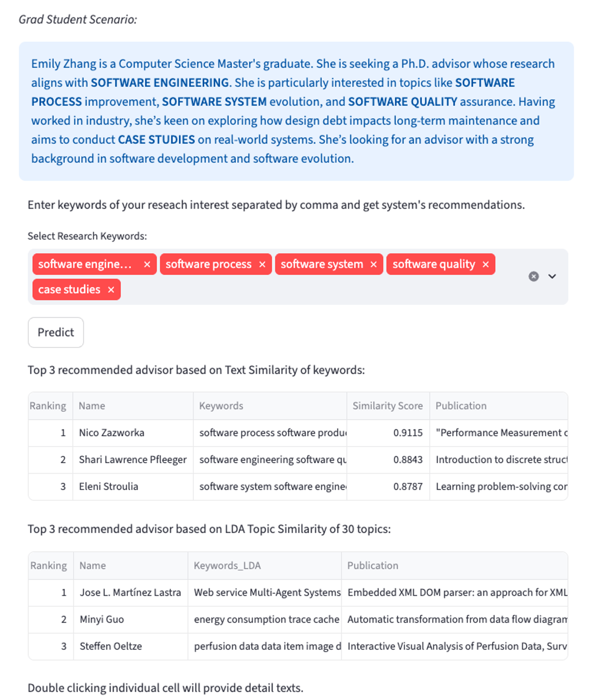
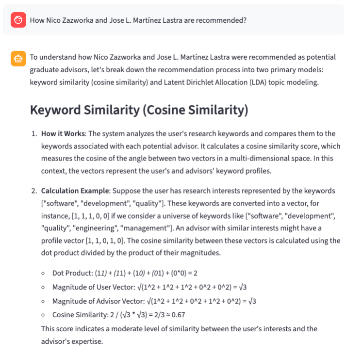
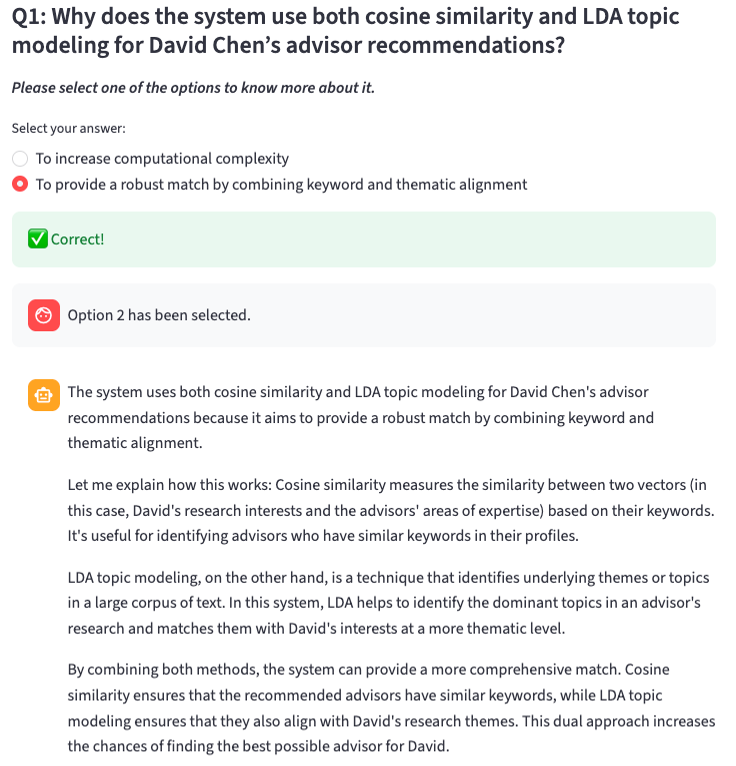

# 🧠 Conversational Explainable Recommender System  
### From Prompting to Understanding: Enhancing User Comprehension in Conversational Explainable Recommender Systems

---

## 📌 Overview
Conversational recommender systems increasingly rely on Large Language Models (LLMs) to generate natural language explanations. However, their effectiveness depends on users’ ability to ask meaningful follow-up questions—something many users struggle with.

This project addresses that gap by introducing **guided interaction techniques** that scaffold user engagement and improve comprehension of AI-generated recommendations.

---
## 🎥 Demo & User Study Walkthrough

### 📹 Full User Study Demo
A complete walkthrough of the system, including scenario selection, recommendation generation, and guided interaction.

👉 [Watch Full Demo Video](https://youtu.be/yPALr1OtNRs)  

---

## 🖼️ System Interface

\
### 🎯 Recommendation Output
Users begin by selecting a scenario (e.g., research interests or patient case) to receive recommendations. The system generates top recommendations based on similarity and topic modeling.

---

### 💬 Version 1: Starter Questions Interface
Provides predefined questions to help users initiate explanation-seeking.

---

### 🧠 Version 2: Quiz-Based Interaction Interface
Engages users with multiple-choice questions and feedback to improve understanding.

---

## 🎯 Key Interaction Difference
- **Version 1:** Passive exploration (click & read)  
- **Version 2:** Active reasoning (answer & learn)  

---

## 💡 Key Contributions
- 🤖 LLM-powered conversational explanation system  
- 🎯 Advisor Recommender System using:
  - Cosine Similarity (text-based matching)
  - LDA Topic Modeling (research alignment)
- 💬 Guided interaction design:
  - **Starter Questions** → help initiate exploration  
  - **Quiz-Based Prompts** → encourage active reasoning with feedback  
- 🧪 Empirical evaluation via user study (N=20)

---

## 🧪 Research Summary
We conducted a **2 × 2 within-subjects study** across:
- Interaction Types: Starter Questions vs Quiz-Based Prompts  
- Domains:  
  - Medical Specialist Recommendation (high-stakes)  
  - Graduate Advisor Recommendation (low-stakes)  

### 📊 Key Findings
- Quiz-based prompts significantly improve **objective understanding**  
- Guided interaction supports **deeper engagement and mental model formation**  
- Domain context influences **trust and perceived usefulness**

---

## 🏗 System Architecture
The system consists of:

1. **Recommender Engine**
   - Text similarity (cosine similarity on publication keywords)
   - Topic similarity (LDA-based)

2. **LLM Explanation Module**
   - Generates natural language explanations
   - Handles follow-up user queries

3. **Guided Interaction Layer**
   - Starter questions (low cognitive load)
   - Quiz-based prompts (interactive learning)

4. **User Interface**
   - Built with Streamlit for real-time interaction

---

## ⚙️ Tech Stack
- **Programming:** Python  
- **Frontend:** Streamlit  
- **LLM:** LLaMA / API-based models  
- **NLP:** Cosine Similarity, LDA Topic Modeling  
- **Database:** Supabase (PostgreSQL)  
- **Concepts:** Prompt Engineering, RAG  

---

